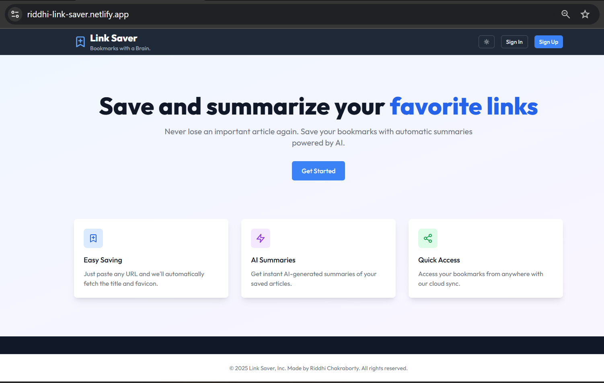
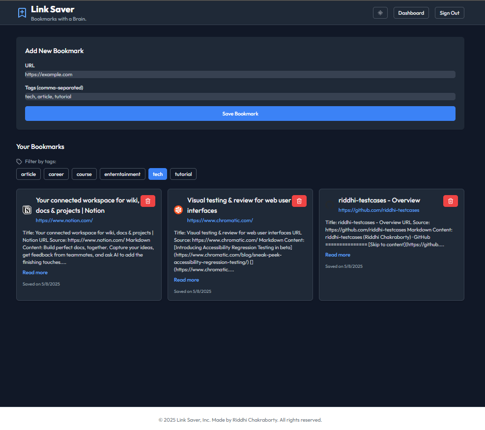

# Link Saver + AI Summary - Bookmarks with a Brain 

A modern web application for saving and organizing bookmarks with automatic AI-powered summaries. Built with React, TypeScript, and Supabase.


*Link Saver page with sign in/sign out options*

##  Screenshots


*Dashboard showing bookmarks grid*


*Dark mode with feature highlights*

## Features

- **User Authentication**
  - Secure email/password authentication
  - Protected routes and user-specific data
  - Persistent sessions

- **Smart Bookmarking**
  - Automatic title and favicon extraction
  - AI-powered content summarization
  - Tag-based organization
  - Clean, readable summaries with section highlighting

- **Modern UI/UX**
  - Responsive grid layout
  - Dark mode support
  - Loading states and error handling
  - Smooth animations and transitions

- **Advanced Features**
  - Tag filtering system
  - Expandable summaries
  - URL validation
  - Error boundary protection

##  Tech Stack

- **Frontend**
  - React 18 with TypeScript
  - Vite for blazing-fast development
  - TailwindCSS for styling
  - React Router for navigation
  - React Hook Form for form handling
  - Lucide React for icons

- **Backend & Database**
  - Supabase for authentication and data storage
  - PostgreSQL with Row Level Security
  - Edge Functions for metadata extraction and AI summaries

- **Testing**
  - Vitest for unit testing
  - React Testing Library for component testing
  - Jest DOM for DOM testing utilities

##  Getting Started

1. **Clone and Install**
   ```bash
   git clone https://github.com/yourusername/link-saver.git
   cd link-saver
   npm install
   ```

2. **Environment Setup**
   Create a `.env` file:
   ```env
   VITE_SUPABASE_URL=your_supabase_url
   VITE_SUPABASE_ANON_KEY=your_supabase_anon_key
   ```

3. **Development**
   ```bash
   npm run dev
   ```

4. **Testing**
   ```bash
   npm run test
   ```

5. **Build**
   ```bash
   npm run build
   ```

##  Testing

The project includes comprehensive tests for core components:

- **BookmarkForm**: Form validation, submission handling
- **BookmarkItem**: Rendering, interaction handling
- **Button**: Variants, loading states, accessibility
- **TagFilter**: Tag selection, filtering logic

Example test:
```typescript
describe('BookmarkForm', () => {
  it('validates required URL field', async () => {
    render(<BookmarkForm onSubmit={mockOnSubmit} />);
    const submitButton = screen.getByRole('button', { name: /Save Bookmark/i });
    fireEvent.click(submitButton);
    expect(await screen.findByText(/URL is required/i)).toBeInTheDocument();
  });
});
```

##  Future Improvements

1. **Enhanced Organization**
   - Folder support
   - Nested tags
   - Custom sorting options

2. **Advanced Features**
   - Full-text search
   - Bookmark sharing
   - Reading time estimates
   - Browser extension

3. **Performance**
   - Infinite scrolling
   - Virtual list rendering
   - Image optimization

4. **User Experience**
   - Customizable themes
   - Keyboard shortcuts
   - Bulk operations
   - Import/export functionality

##  Development Time

This project was developed over approximately 6 hours:

- Initial setup and authentication (1 hour)
- Core bookmark functionality (2 hours)
- UI components and styling (1.5 hours)
- Testing implementation (1 hour)
- Documentation and refinements (0.5 hours)
